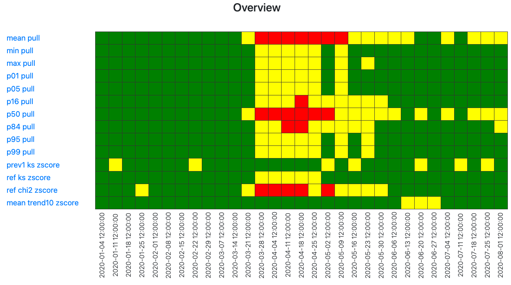
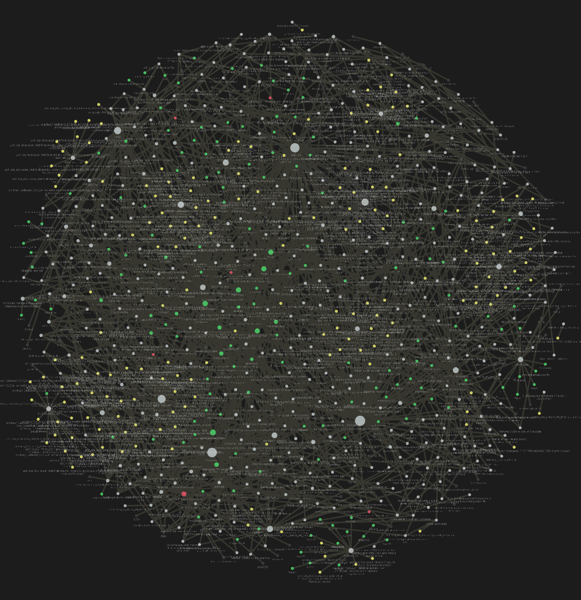

# Wu's Portfolio
Project portfolio for Oscar Wu, hosted on GitHub Pages. If you have any questions or would like to get in touch, please feel free to reach out to me at oscarwu600@gmail.com.

# [Project 1: GPTFusion - An AI Chatbot Mastering Multi-Model Integration & Dynamic Interactions](https://github.com/OWU-4f5755/gptfusion_langchain)
## Summary
Created a versatile AI chatbot that works seamlessly with multiple GPT models; offers tailored document integration, conversation history management; and exhibits multi-input functionality on a client-facing API by leveraging Gradio, Python, and the OpenAI API.

## Key Features
1. Integrated a vector index to efficiently ingest unstructured data within common file types, including native PDFs, CSVs, TXTs, and SQL files.
2. Constructed a feature that facilitated users in specifying a subset of ingested files; users can enumerate any combination of desired filenames, which can be subsequently utilized as input for built-in NLP operations.
3. Extended the ability of the baseline GPT API to now retain and call on prior user-defined prompts and responses, optionally across multiple chat sessions, and combine the recorded conversation history with user file subsets as a singular input for NLP tasks plus baseline GPT model operations.
4. Initialized two pairs of GPT "Agents" on the deployed Gradio interface, where users can optionally enable, via a checkbox: cross-instance interaction and chained prompt and answer pairs.

  
*Figure 1: Sequence diagram generated in MermaidJS illustrating the GPT-4 AI system's primary components and interactions, optional conversation history access and parallel processing of input texts from two chatbot instances. User API key security handling is defined/instance by the user at the point of API call.*

# [Project 2: Advanced Facial Image Morphing with Latent Space Interpolation using StyleGAN2 and Dlib ResNET](https://github.com/OWU-4f5755/facial_detection_gan_pytorch/tree/main)

## Summary
Developed a comprehensive end-to-end pipeline that processes input images, utilizes a pretrained StyleGAN2 model to project them into the latent space, and generates a smooth morphing video between facial images through latent space interpolation.

## Key Features
1. Utilized the state-of-the-art StyleGAN2 generative model to produce realistic and high-quality face morphing videos.
2. Automated facial landmark detection and cropping using a well-established, pretrained neural network library, enhancing input image compatibility with the StyleGAN2 model.
3. Implemented a seamless pipeline that can be executed on Google Colab, offering an accessible platform with GPU support for widespread use.

  
*Figure 2: Sample Morphing video generated by the pipeline, using a pretrained StyleGAN2 model and a pair of input images.*

# [Project 3: Investigating the Socioeconomic Impact on Emergency Department Patient Arrivals during COVID 2020: A Comprehensive Time Series Analysis Approach](https://github.com/OWU-4f5755/covid2020_wu_utsw)

## Summary
Conducted an analysis that investigates the impact of socioeconomic factors on daily patient arrivals at emergency departments during COVID 2020, identifying patterns and associations using advanced time series techniques.

## Key Features
1. Examined the Health Equity Index (formerly Socioeconomic Needs Index), a measure of socioeconomic need that is correlated with poor health outcomes, to identify areas of highest need and advance equitable outcomes.
2. Employed advanced time series analysis techniques, including ClaSP segmentation and Dynamic Time Warping, to identify structural changes and find optimal alignments between time series.
3. Examined various population patterns, such as changes during the shelter-in-place duration and recovery after, as well as how different socioeconomic groups contribute to the overall trends in daily patient arrivals.
4. Utilized heatmaps and warping path plots, in addition to statistical tests like Pearson correlation, for analysis of several hundred-thousand rows of fairly complex, uncleaned, patient data from EPIC.

  
*Figure 3: Traffic light heatmap of daily patient arrivals at Parkland's emergency department during COVID 2020, with the x-axis representing the day of the year and the y-axis representing different calculated statistics based on the normalized residue of the time series. The colors (green, yellow, red) indicate the level of deviation from the reference.*

# [Project 4: Enhancing Literature Reviews and Scientific Writing through an End-to-End Pipeline](https://github.com/OWU-4f5755/UTSW-Wu-Obs-Vault)

## Summary
Created a pipeline that streamlines the process of conducting literature reviews and fosters novel idea creation by integrating multiple programming languages and research tools to create a comprehensive, integrative knowledge bank and research workflow system.[^f1]

## Key Features
1. Integration of multiple programming languages (JavaScript, Python, SQL) and research tools (Obsidian, VS Code, Zotero) to create an efficient and unified research workflow.
2. Utilization of PyTesseract for Optical Character Recognition (OCR),to extract text from images and PDFs, indexes them in a database, and allows quick of access related text in a command palette.
3. Implementation of wikilinks to connect related notes and create a knowledge graph, the system visualizes the relationships between notes and applies graph algorithms (Jaccard, Otsuka-Chiai, Bag of Words, Louvain, Label Propagation) to assess similarity, predict links, and cluster notes via community detection, ultimately fostering the generation of novel ideas and insights.
4. Automatically scheduled synchronization of changes to notes with Git and GitHub, ensuring version control and data integrity
5. Efficiently exporting documents or annotations from markdown, linked to BibTeX references of archived scientific articles in Zotero, to a variety of file formats (Microsoft Word, PDF) and, if needed, adhering to the citation styles prescribed by respective academic journals.

  
*Figure 4: Knowledge graph generated by the pipeline, visualizing the relationships between notes and graph algorithm-generated tags to assess similarity, predict links, and organize.*  

[^f1]: This project is currently in a private repository, as it is a personal collection, but I am happy to share more details upon request.
