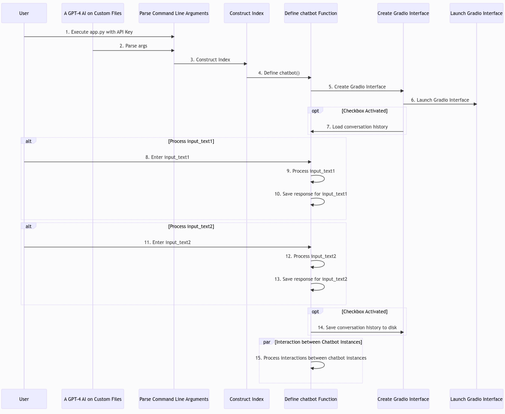

# Wu's Portfolio
Project portfolio for Oscar Wu, hosted on GitHub Pages

# [Project 1: GPTFusion - An AI Chatbot Mastering Multi-Model Integration & Dynamic Interactions](https://github.com/OWU-4f5755/gptfusion_langchain)
## Summary
Created a versatile AI chatbot that works seamlessly with multiple GPT models; offers tailored document integration, conversation history management; and exhibits multi-input functionality on a client-facing API by leveraging Gradio, Python, and the OpenAI API.

## Key Features
1. Integrated a vector index to efficiently ingest unstructured data within common file types, including native PDFs, CSVs, TXTs, and SQL files.
2. Constructed a feature that facilitated users in specifying a subset of ingested files; users can enumerate any combination of desired filenames, which can be subsequently utilized as input for built-in NLP operations.
3. Extended the ability of the baseline GPT API to now retain and call on prior user-defined prompts and responses, optionally across multiple chat sessions, and combine the recorded conversation history with user file subsets as a singular input for NLP tasks plus baseline GPT model operations.
4. Initialized two pairs of GPT "Agents" on the deployed Gradio interface, where users can optionally enable, via a checkbox: cross-instance interaction and chained prompt and answer pairs.

*Figure 1: Sequence diagram generated in MermaidJS illustrating the GPT-4 AI system's primary components and interactions, optional conversation history access and parallel processing of input texts from two chatbot instances. User API key security handling is defined/instance by the user at the point of API call.*

# [Project 2: Advanced Facial Image Morphing with Latent Space Interpolation using StyleGAN2 and Dlib ResNET](https://github.com/OWU-4f5755/facial_detection_gan_pytorch/tree/main)

## Summary
Developed a comprehensive end-to-end pipeline that processes input images, utilizes a pretrained StyleGAN2 model to project them into the latent space, and generates a smooth morphing video between facial images through latent space interpolation.

## Key Features
1. Utilized the state-of-the-art StyleGAN2 generative model to produce realistic and high-quality face morphing videos.
2. Automated facial landmark detection and cropping using a well-established, pretrained neural network library, enhancing input image compatibility with the StyleGAN2 model.
3. Implemented a seamless pipeline that can be executed on Google Colab, offering an accessible platform with GPU support for widespread use.

*Figure 2: Sample Morphing video generated by the pipeline, using a pretrained StyleGAN2 model and a pair of input images.*
